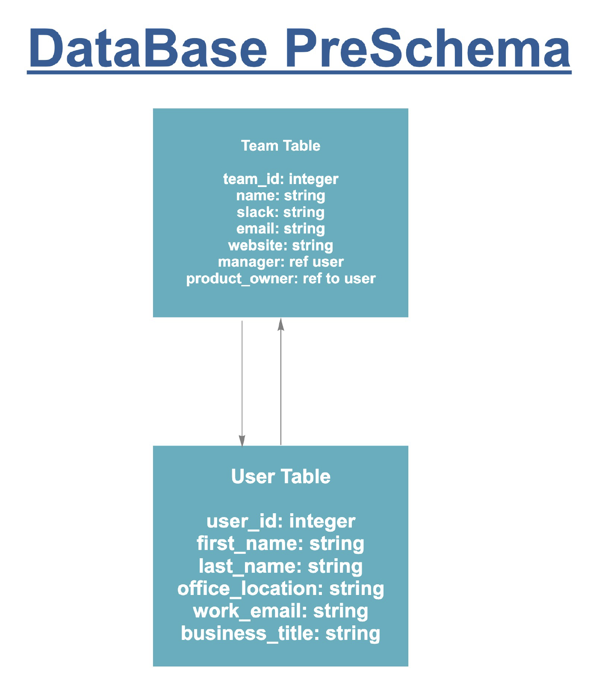

# Work Buddies

  Work Buddies is a web application that allows registered users to search for individuals or teams. Upon completing a search you will get the basic work information for a searched individual and team, this includes their geographic work location.  

Work Buddies address the following issues a company faces: 

- Get geographical information about individual or teamFind who is working on a specific team
- What is the best time for me to schedule a meeting with an individual (Taking timezone into consideration)

- Easily get the contact to an individual and team

## Installing

To get a development environment running. 

1. First `cd` into the the root directory of the project.

2. Install all npm dependencies the project uses. This can be done by running the
   following command:

#### `npm install`

Upon completion you will now be able to run all other available scripts.

### Available Scripts

In the project directory, you can run:

#### `npm start`

Runs the app in the development mode. 
Open [http://localhost:3000](http://localhost:3000) to view it in the browser.

The page will reload if you make edits. 
You will also see any lint errors in the console.

#### `npm test`

Launches the test runner in the interactive watch mode. 
See the section about [running tests](https://facebook.github.io/create-react-app/docs/running-tests) for more information.

#### `npm run build`

Builds the app for production to the `build` folder. 
It correctly bundles React in production mode and optimizes the build for the best performance.

The build is minified and the filenames include the hashes. 
Your app is ready to be deployed!

